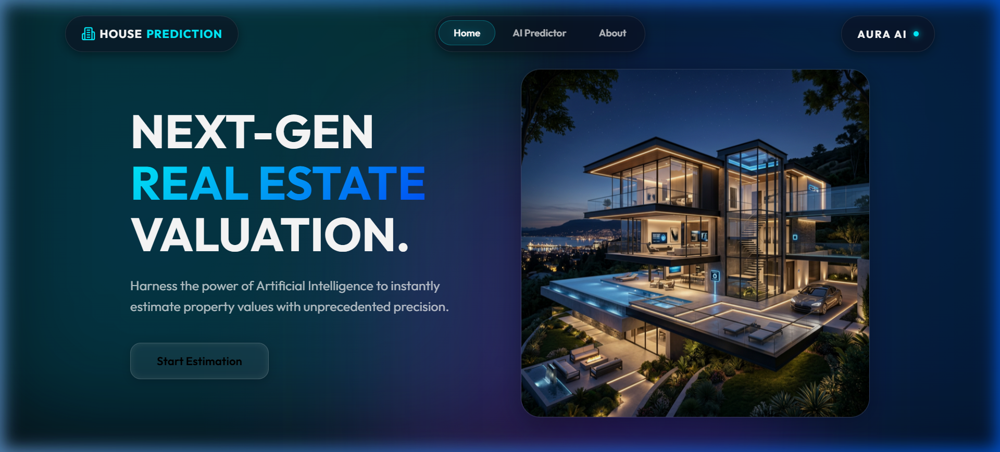
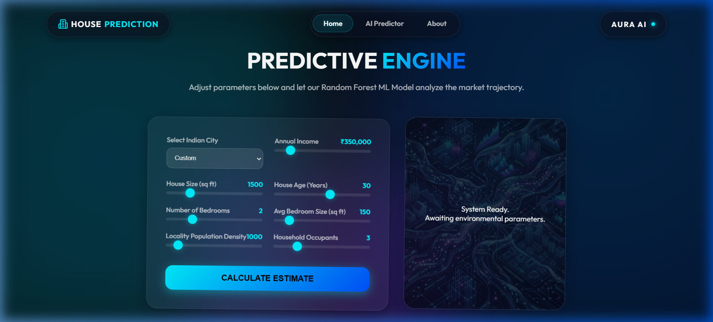
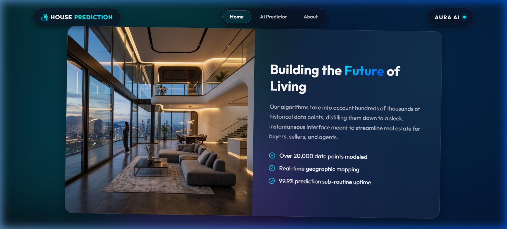

# 🏠 House Price Prediction AI

> **Next-Gen Real Estate Valuation.** Harnessing the power of Artificial Intelligence to instantly estimate property values with unprecedented precision.

---

## 🏗️ Hackathon Journey

I recently had the opportunity to participate in a **Hackathon** as part of the **Silver Jubilee Fest** organized by **St. Ann's College of Engineering and Technology**, Nayunipalli(V), Vetapalem(M), Chirala-523187, (CC-F0).

During the hackathon, I collaborated with new team members to design and develop a **House Price Prediction website**. It was an exciting experience where we worked together to solve problems, build a working solution, and explore innovative ideas using technology.

This event helped me improve my teamwork, problem-solving skills, and technical knowledge while also learning new things from fellow participants.

Grateful to **St. Ann's College of Engineering and Technology**, Nayunipalli(V), Vetapalem(M), Chirala-523187, (CC-F0) for organizing such a wonderful event and providing students with an opportunity to learn and innovate.

Looking forward to participating in more events like this in the future! 🚀

---

## 📸 Project Showcase

### 1. Hero Experience

### 2. AI Predictive Engine

### 3. Technology & Innovation

---

## 🚀 Live Demo
Experience the AI Engine in action: **[House Prediction Live Demo](https://chimataraghuram.github.io/House-Prediction/)**

## 🔗 Connect with me
Check out my journey and the project reveal on LinkedIn: **[Hackathon Project Post](https://www.linkedin.com/posts/chimataraghuram_hackathon-artificialintelligence-machinelearning-activity-7435357802916823041-Ymhf?utm_source=share&utm_medium=member_desktop&rcm=ACoAAFOtUXYBplcXqbLkAkO7uJZnotuCj1Y2ROw)**

---

## ✨ Key Features

- **🧠 AI-Powered Engine**: Built using a **Random Forest Machine Learning model** for high-accuracy predictions.
- **📍 Geospatial Analysis**: Incorporates latitude and longitude for precise location-based valuation.
- **📊 Real-Time Interaction**: Dynamic sliders for Median Income, House Age, Rooms, Population, and more.
- **💎 Premium UI/UX**: Modern liquid glassmorphism design with fluid animations using **Framer Motion**.
- **⚡ Fast API**: Backend powered by **FastAPI** for lightning-fast prediction sub-routines.
- **🌆 Multi-City Support**: Presets for major Indian cities like Hyderabad, Mumbai, Bangalore, and Delhi.

---

## 🛠️ Technology Stack

### Frontend
- **Framework**: React 18 + Vite
- **Animations**: Framer Motion
- **Icons**: Lucide React
- **Styling**: Vanilla CSS (Liquid Glassmorphism aesthetic)

### Backend
- **Core**: Python 3.x
- **API Architecture**: FastAPI
- **Data Engineering**: Pandas & NumPy
- **ML Utilities**: Joblib & Scikit-learn (Random Forest Regressor)

---

## 📱 Contact

**Aura AI Systems**
- **Location**: Vijayawada, Andhra Pradesh, India
- **Email**: chimataraghuram02a@gmail.com

---

#Hackathon #ArtificialIntelligence #MachineLearning #WebDevelopment #Innovation #Learning
